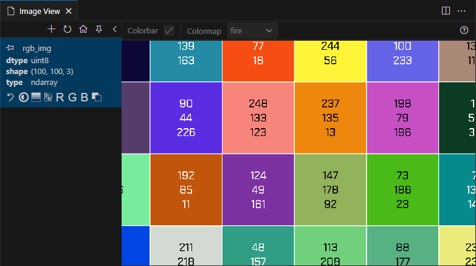
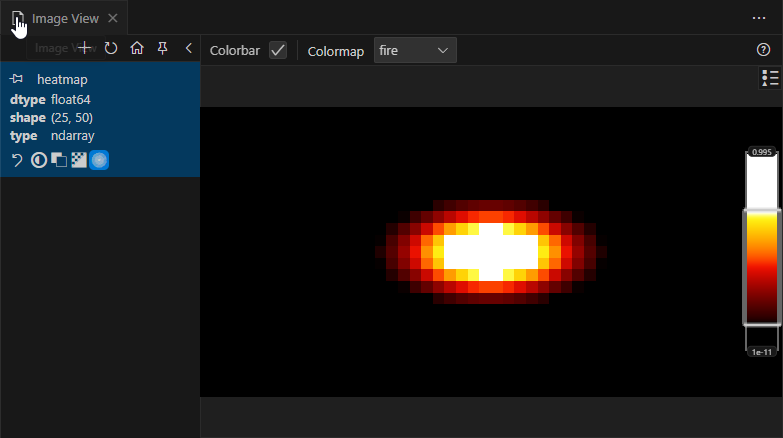
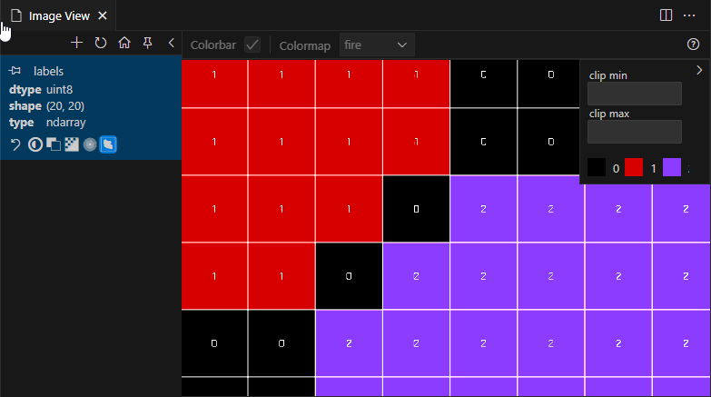

# Simply View Image for Python Debugging

This extension offers a powerful and versatile solution for visualizing images, plots, and tensors during Python debugging. It is designed to enhance your debugging workflow with a rich set of features.

## Features

### Image Viewer

A built-in, enhanced image viewer with the following capabilities:
<!-- - **Image Values**: Display pixel values directly on the image. 
- **Heatmap**: Visualize images as heatmaps with customizable color maps. 
- **Segmentation**: View label images with color mapping (e.g., 0=black, 1=red, etc.).  -->
<div style="display: flex; gap: 20px; flex-wrap: wrap; text-align: center; justify-content: center;">
  <div style="display: flex; flex-direction: column; align-items: center; width: 300px;">
    <h4>Image Values</h4>
    
    <p style="word-break: break-word; white-space: normal; margin: 0 0 8px 0;">Display pixel values directly on the image.</p>
  </div>
  <div style="display: flex; flex-direction: column; align-items: center; width: 300px;">
    <h4>Heatmap</h4>
    
    <p style="word-break: break-word; white-space: normal; margin: 0 0 8px 0;">Visualize images as heatmaps with customizable color maps and value clipping.</p>
  </div>
  <div style="display: flex; flex-direction: column; align-items: center; width: 300px;">
    <h4>Labels</h4>
    
    <p style="word-break: break-word; white-space: normal; margin: 0 0 8px 0;">View label images with color mapping (e.g., 0=black, 1=red, etc.).</p>
  </div>
</div>

### Plot Viewer

Visualize plots from various sources, including:

- `matplotlib.pyplot.Figure`
- `matplotlib.pyplot.Axis`
- Plotly Figures (requires saving backend, see [here](https://plotly.com/python/static-image-export)).

### Tensor Viewer

Inspect tensors from PyTorch and NumPy.

- `numpy.ndarray` is treated as a tensor if it has 4 channels or 3 channels but does not qualify as a single image. Requires `scikit-image`.

### Watch View

Monitor image, plot, or tensor variables and refresh the view at each breakpoint.

- Supports custom Python expressions (use with caution to avoid side effects).

### Additional Features

- Hover over variables to view their shape (unrelated to the image viewer, but useful nonetheless).
- Open local image files (supports PNG, JPG, BMP, TIFF) in the viewer.
  </br><sub>I find this feature useful for label images, as they often have small values (0, 1, etc.), which the default viewer does not enhance.</sub>
- A colorbar for heatmap images with adjustable value clipping.
- Interactive Python cell support: Use the **Variables** tab and click the arrow next to a variable name to view the image.

## Settings

| Setting                     | Description                                                                                                                                                                                                                                                                                    | Default Value |
| --------------------------- | ---------------------------------------------------------------------------------------------------------------------------------------------------------------------------------------------------------------------------------------------------------------------------------------------- | ------------- |
| `svifpd.autoFetchImages`    | Controls whether images are automatically fetched. <ul> <li><code>true</code>: Automatically fetch images at each step.</li> <li><code>false</code>: Fetch images only when the "Fetch Image" button is clicked.</li> <li><code>"pinned"</code>: Automatically fetch pinned images.</li> </ul> | `true`        |
| `svifpd.restrictImageTypes` | Restricts the types that are considered images. <ul> <li><code>true</code>: Only numpy is checked.</li> <li><code>false</code>: All types are checked.</li> </ul> This setting is useful for improving performance in some cases.                                                              | `true`        |

## Q&A

### Memory Issues

**Problem**: Memory usage increases significantly when using the extension.

**Solution**: Enable the `restrictImageTypes` setting (default: `true`).

---

## Extension Links

- [VS Code Marketplace](https://marketplace.visualstudio.com/items?itemName=elazarcoh.simply-view-image-for-python-debugging)
- [Open VSX Registry](https://open-vsx.org/extension/elazarcoh/simply-view-image-for-python-debugging)

## Acknowledgment

This extension builds upon the foundational work of [john-guo](https://github.com/john-guo/simply-view-image-for-python-opencv-debugging). While none of the original code remains, his project served as a valuable inspiration for this extension. Thank you, John!

## Development

### Prerequisites

- **Node.js**: Ensure you have Node.js installed.
- **Yarn**: Install Yarn as the package manager.
- **Rust**: Required for building the webview.

### Build Instructions

1. Install dependencies:
   ```bash
   yarn install
   ```
2. Build the project:
   ```bash
   yarn build
   ```
