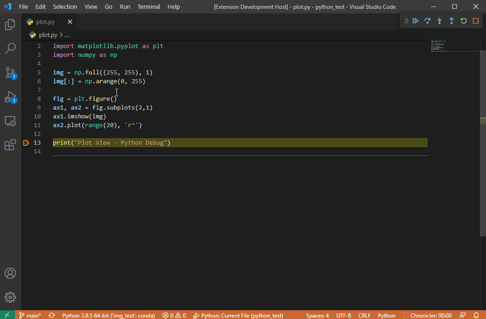
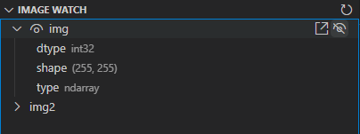

# simply-view-image-for-python-debugging

Based on the great work of [john-guo](https://github.com/john-guo/simply-view-image-for-python-opencv-debugging), a more general version for the extension.

## Features

* Support view image from expression
  * **NOTE when using this feature, the expression is actually executed, so beware of side-effects**
  
* Support plot (matplotlib) view
  * Currently supports:
    * matplotlib.pyplot.Figure
    * matplotlib.pyplot.Axis
  
  
* Support Tensor view (only pytorch, for now) 

### Watch view

Added a watch view, for watching image/plot/tensor variables, while refreshing the image-view at each breakpoint.

* By default, it'll show only image variables. To show plot/tensor, edit the configuration at: "svifpd.imageWatch.objects".

## Feature-Requests

If you want me to add other debug-viewers for your objects, please open an issue for it, and provide simple example (in python, of course) of how to save an image from your object.

## Dependencies

* python>=3.4
