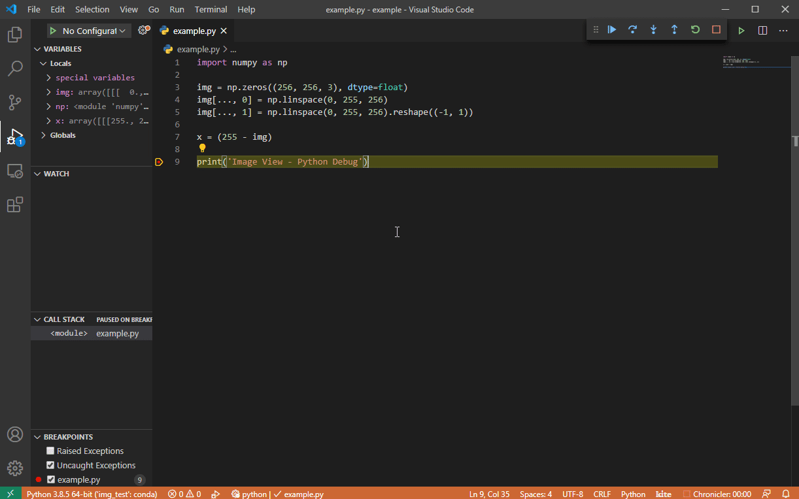

# simply-view-image-for-python-debugging

Based on the great work of [john-guo](https://github.com/john-guo/simply-view-image-for-python-opencv-debugging), a more general version for the extenstion.

## New features

* No need for opencv (we support multiple backend)
* No include is needed by the user
* Support view image from expression
  
  

## Dependencies

* python>=3.4
* At least one of the following packages are need to be installed:
  - opencv
  - skimage
  
  - more options to come (see [TODO 1](#TODO))

## TODO
1. add more backends (Pillow, matplotlib, imageio)
1. add no-backend option that uses: https://stackoverflow.com/a/19174800 (a pure python implementation)
1. (optionally) allow users to choose the preference order of the save backends
1. allow users to define custom preprocess
1. allow users to define custom save backend
